# Data Studio V2 Option 3 — Customer Health Scorecard Walkthrough

> **Analyst persona:** Data analyst at Uber.
> **Goal:** Build a composite Customer Health Score combining NPS, product usage, and order frequency.
>
> **Sources used:**
> - `customers` and `orders` — Snowflake CDW
> - `customer_health_import.csv` — local CSV (NPS + health signals)
> - `pendo_nps` — Pendo Business Apps connector
> - Python block — formula for composite health score

---

## Step 1: Overview Screen

The Data Studio V2 prototype loads on the **overview screen**. As a data analyst at Uber, I want to build a Customer Health Scorecard that combines three heterogeneous data sources: Snowflake CDW tables, a manually-maintained CSV of NPS and health signals, and Pendo usage data via an API connector. Management wants a composite score: NPS + product usage + order frequency. I need Option 3 — the multi-source canvas mode. **UX observation:** The overview screen presents the mode options clearly in the sidebar. I need to pick Option 3 *before* clicking 'New model', or I land in the wrong canvas mode.

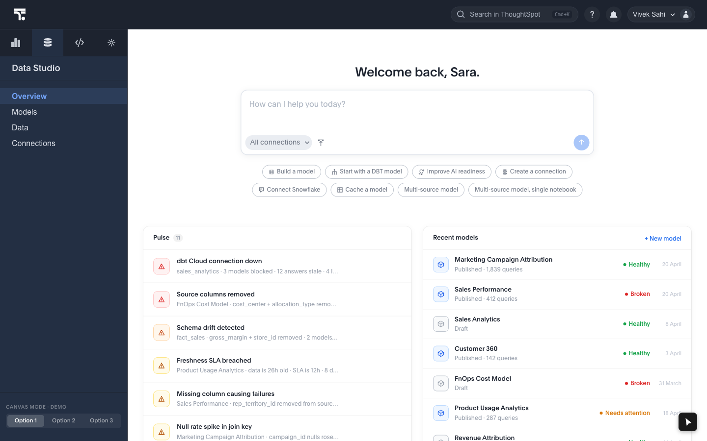

---

## Step 2: Select Option3

I click **Option 3** in the sidebar. This switches the canvas mode to `dataset2` — the multi-source canvas. **UX observation:** The sidebar labels (Option 1, 2, 3) are placeholder names, not descriptive. A first-time user has no cue that 'Option 3' is the 'multi-source' or 'federated' mode. A label like 'Multi-source' or 'Federated model' would remove the need to know which number to pick.

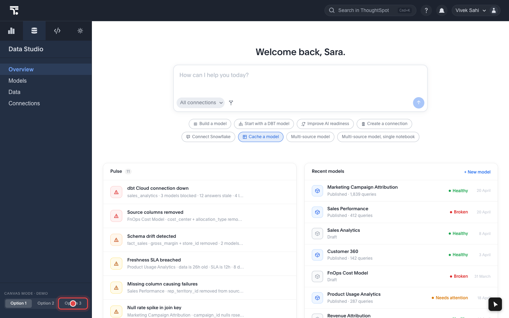

---

## Step 3: Click New Model

I click **+ New model**. This calls `newProject()` which sets `view = 'canvas'`, rendering the `ModelCanvas` in a fixed full-screen overlay. **UX observation:** The button is styled as a plain inline text link (no Radiant Button component, no border, no background) — it has low visual weight and could be easily missed. A new user scanning for a CTA might look for a filled or outlined button. The `+` prefix helps, but a ghost or filled button variant would be clearer.

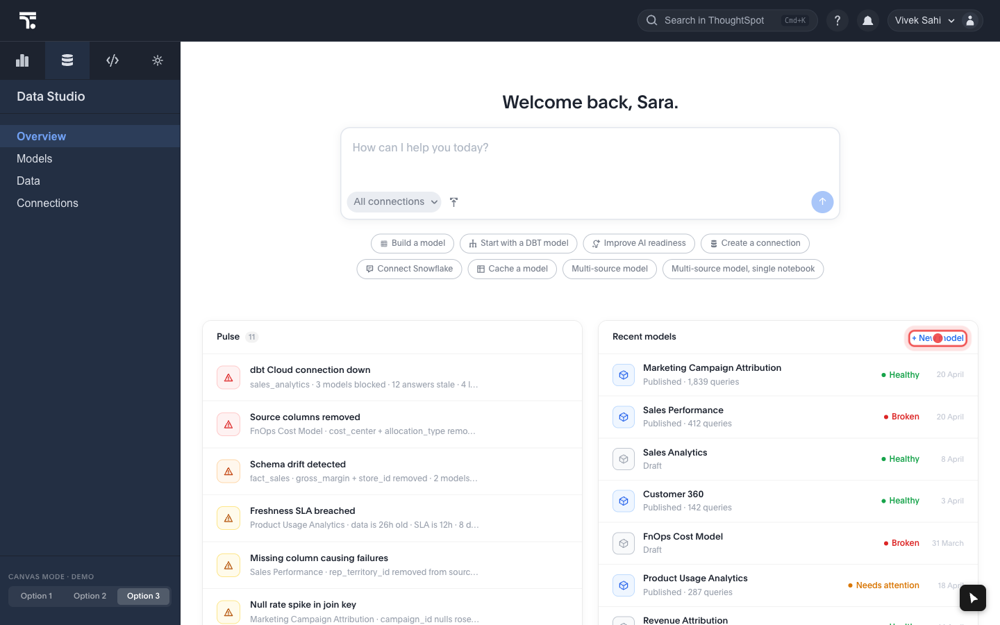

---

## Step 4: Canvas Empty

The canvas opens in **dataset2 mode** — empty state. I can see:

- Left: **Data browser panel** with Warehouse tab open and the Snowflake tree expanded (`snowflake-prod / sf-analytics / sf-public`).
- Center: **Empty canvas** — a white grid area where source blocks will appear.
- Right: **Properties panel** — currently empty/contextless.
- Top: **Floating toolbar** with an 'Add data' button (the only toolbar CTA in dataset2 mode).

**UX observation:** The empty canvas state gives no visual cue about *how* to add sources — there's no empty-state illustration or onboarding hint pointing at the data browser or 'Add data'. A new user might click 'Add data' (correct) but they might also try dragging from the browser or looking for a file upload zone on the canvas itself.

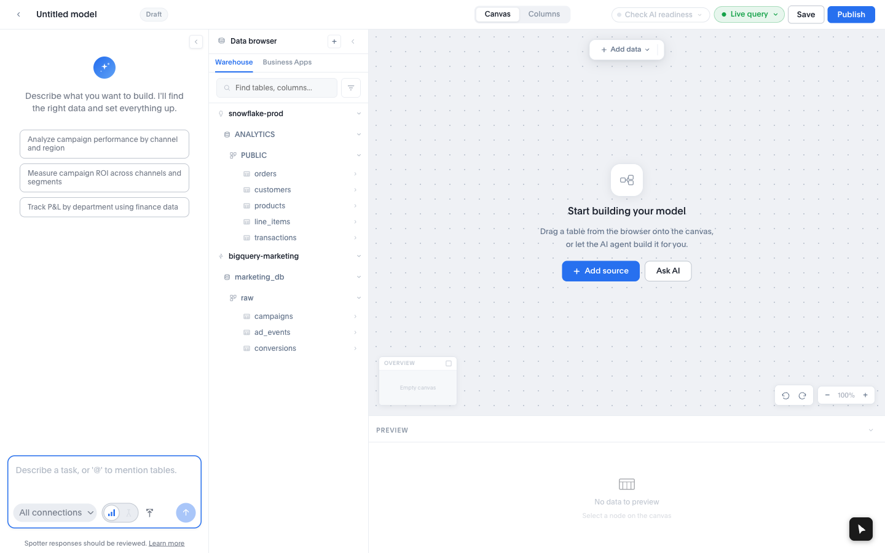

---

## Step 5: Open Add Data Menu

I click **Add data** in the toolbar. This opens a dropdown with options: CDW data, Upload CSV, SQL, Python. **UX observation:** 'Add data' is the primary CTA in dataset2 mode. The toolbar only shows this one button (no Join, no Transform visible at this stage) — clean, but the label doesn't signal that this is *also* the entry point for file uploads and computed blocks (SQL, Python). A user might expect a separate 'Import' button for files.

---

## Step 6: Select Cdw Data

I select **CDW data** from the dropdown. This calls `addToCanvas('dim_accounts')` internally, which adds a `BlockNode` for `customers` (dim_accounts) at a preset canvas position. **UX observation:** 'CDW data' auto-adds a default table (`dim_accounts`). The user doesn't pick *which* table — it just appears. This is fast but assumes the default is meaningful. A user who wants `orders` first must use the data browser instead.

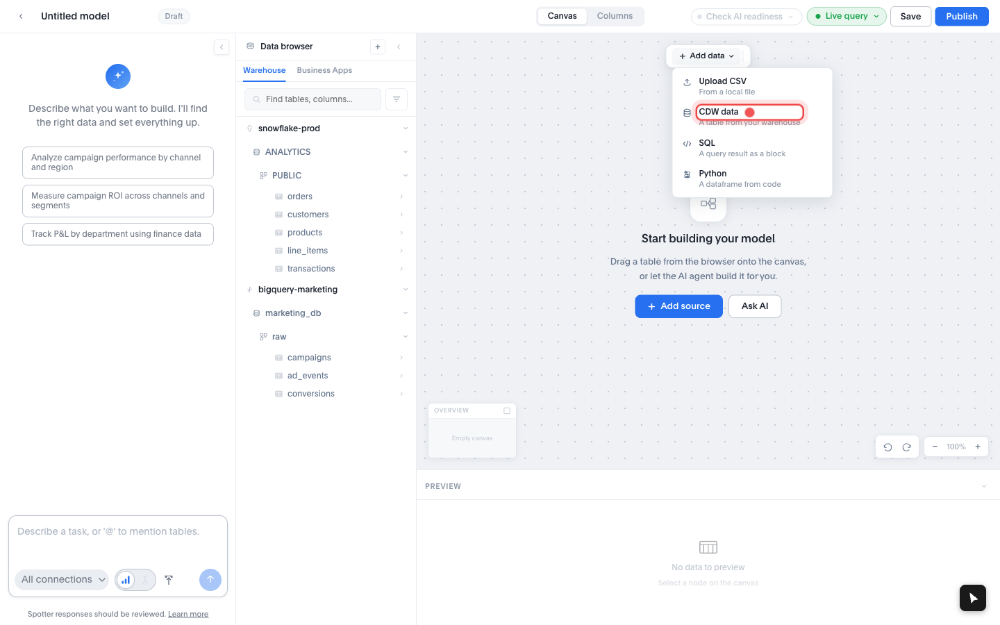

---

## Step 7: Customers On Canvas

The **customers** block appears on the canvas. It's a `BlockNode` card — shows the table name, source badge ('snowflake'), and column count. The right properties panel opened showing a data preview. **UX observation:** Auto-placement works well for the first block. The block is selected on arrival, which immediately shows the preview panel — good progressive disclosure. The block has a hover-visible kebab menu (block actions) and a delete button.

---

## Step 8: Browser Hover Customers

I hover over **customers** in the Snowflake data browser tree. An **Add to canvas** button appears inline — this is a **conditional render** (the button is absent from the DOM until `mouseenter` fires). **UX observation:** The hover-to-reveal pattern is compact but has discoverability risk. Users who move the mouse quickly through the list may not see the button flash into view. There's no persistent hint that 'hovering a row does something'. A faint + icon at the trailing edge of each row (visible always, not just on hover) would improve learnability without cluttering the list.

---

## Step 9: Browser Hover Orders

I hover over **orders** in the tree and click **Add to canvas**. `orders` contains: `order_id`, `order_date`, `customer_id`, `amount`, `status`. I need this to compute engagement signals — recent order volume and average deal size are leading churn indicators. **UX observation:** The hover mechanic is consistent across rows — once discovered on customers, it transfers immediately to orders. Good pattern consistency.

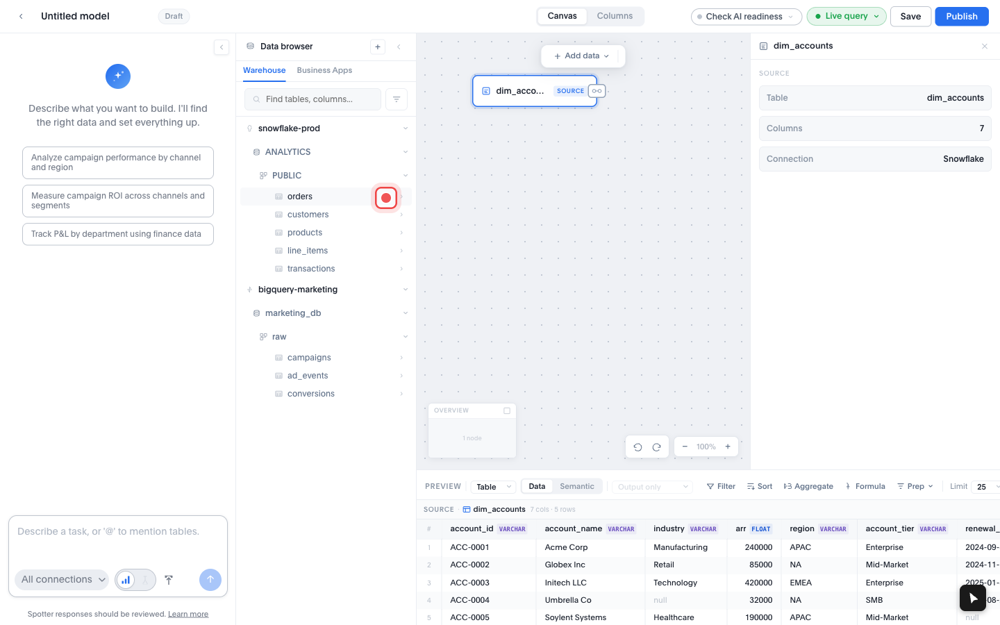

---

## Step 10: Two Cdw Blocks

The canvas now shows **customers** and **orders** as independent `BlockNode` cards. They're positioned at the preset NODE_POSITIONS coordinates — no manual layout needed. Both carry the Snowflake source badge. **UX observation:** The automatic layout places blocks in a predictable grid, but the user has no control over initial placement. For 2 blocks this is fine; for 5+ blocks the canvas starts to look cluttered and users may want to rearrange (which is supported via pointer-drag, but there's no 'auto-arrange' or 'snap-to-grid' visible).

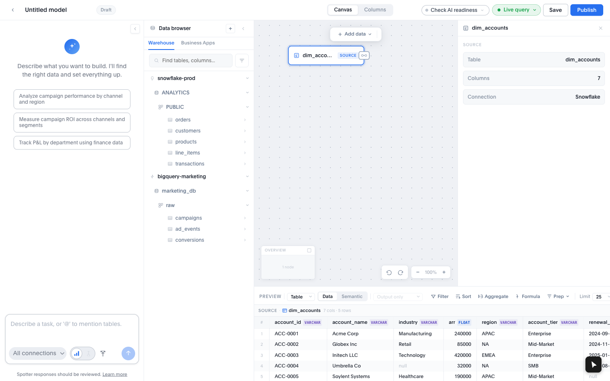

---

## Step 11: Open Add Data For Csv

I click **Add data** again — this time to upload the CSV file. **UX observation:** The same 'Add data' button is the entry point for all source types. This is consistent but means users must remember that file upload is inside a toolbar dropdown, not a dedicated import zone.

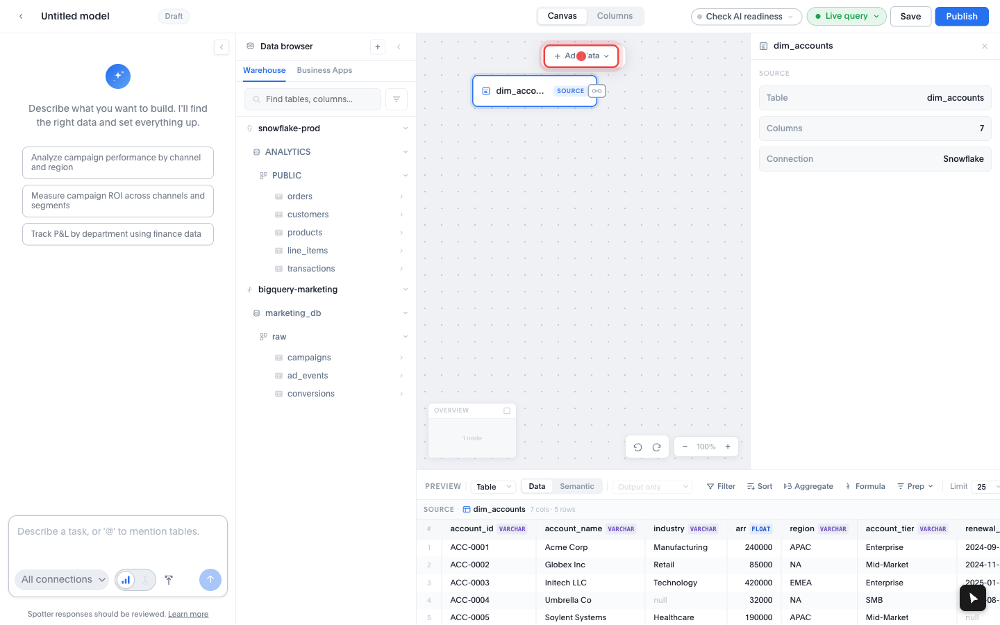

---

## Step 12: Select Upload Csv

I select **Upload CSV** from the dropdown. A file chooser opens immediately. I select `customer_health_import.csv` — 15 accounts with: `account_id`, `nps_score`, `product_usage_pct`, `active_users`, `renewal_arr`, `churn_risk`, `last_qbr_date`, `csm_owner`. Some cells are intentionally blank — these are the data quality gaps the scorecard will surface. **UX observation:** The file chooser fires on click — no intermediate dialog. Fast and direct. The file input is triggered via `fileInputRef.current?.click()` internally.

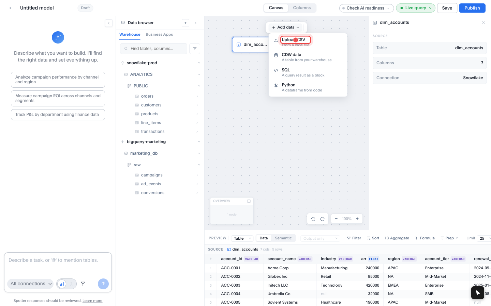

---

## Step 13: Csv Block On Canvas

The **customer_health_import** block appears on the canvas. It's visually distinguished from CDW blocks — a different source badge marks it as a file upload (non-federated source). **UX observation:** The block auto-selects on arrival and shows the preview panel. The file source badge is an important visual signal — it tells the user that this data lives in ThoughtSpot's store, not a live Snowflake query, which has implications for refresh cadence.

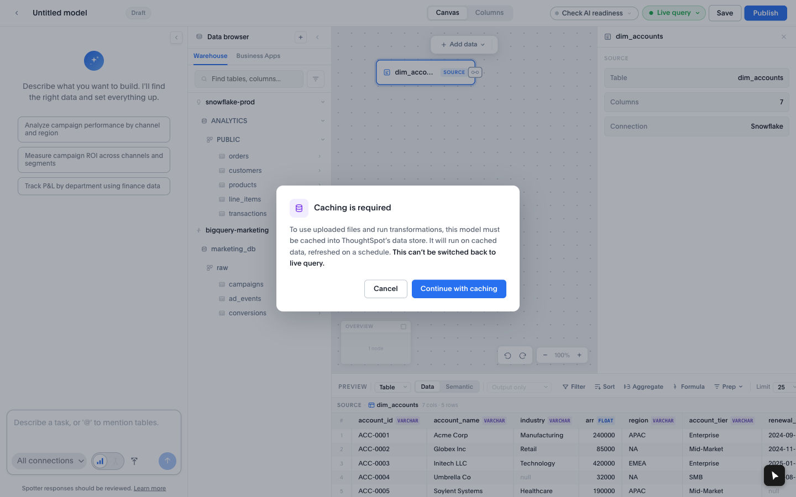

---

## Step 14: Csv Preview With Nulls

The bottom preview panel shows the CSV data. I immediately spot **null values** — several rows have blank `renewal_arr` and `last_qbr_date` columns. These accounts are all tagged `High` churn risk. Before joining, I should fix these nulls to avoid propagating gaps into the health score calculation. **UX observation:** Null values are visible in the preview grid but not flagged or highlighted by the UI. A data quality indicator (red cell, badge count) would make the issue more prominent without requiring manual inspection.

---

## Step 15: Open Block Menu

Attempting to open block menu for Fix nulls.

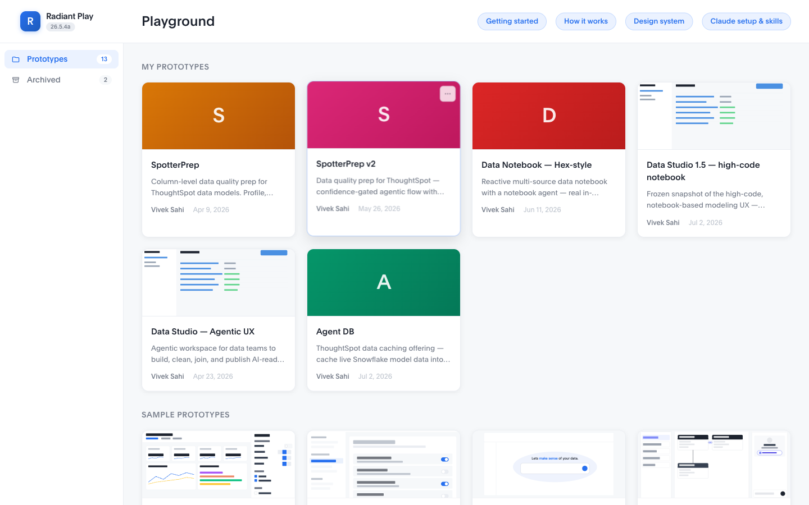

---

## Step 16: Fix Nulls

Attempting Fix nulls prep step.

---

## Step 17: After Fix Nulls

The **Fix nulls** prep step is applied to the CSV block. A step badge or indicator appears on the node showing the active prep steps. **UX observation:** After applying Fix nulls, the canvas node should visually signal that a transformation is active — a step count badge, color change, or 'modified' indicator helps the user track which nodes have been prepared.

---

## Step 18: Switch Business Apps Tab

Switching to Business Apps tab.

---

## Step 19: Add Pendo Nps

I hover over **pendo_nps** and click **Add to canvas**. `pendo_nps` contains: `visitor_id`, `score`, `comment`, `submitted_at`. This is the voice-of-customer signal. The Pendo connector syncs on a schedule, so this data stays fresh automatically — no manual CSV export needed. **UX observation:** Adding from Business Apps works identically to adding from Warehouse — hover → 'Add to canvas' button appears → click. Good consistency. The source badge on the resulting BlockNode will differ (Pendo vs Snowflake), helping the user track data lineage on the canvas.

---

## Step 20: Select Python Block

Attempting to add Python block.

---

## Step 21: Python Block On Canvas

The **Python** block is on the canvas. With it selected, the right properties panel shows: a Python version selector (3.10 / 3.11 / 3.12), a **Libraries** button for pip dependencies, a `CodeEditor` textarea (monospace, styled — not Monaco/CodeMirror), an AI-assist section, and a **Run** button. **UX observation:** The code editor is a plain styled textarea — no syntax highlighting, no autocomplete, no line numbers. For a quick formula this is fine; for complex transformations, analysts will feel the missing IDE features. The AI-assist section is a good affordance — it signals that LLM-generated code is supported, reducing the barrier for non-Python-native analysts.

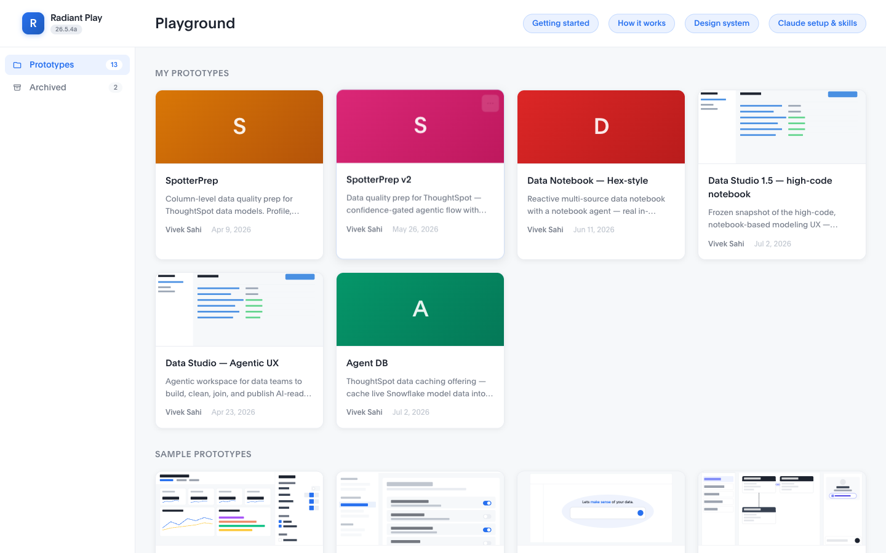

---

## Step 22: Python Editor Detail

**Python editor detail.** The code editor is visible in the right panel. Key UI elements: version selector, Libraries button, CodeEditor textarea, AI-assist section, Run button. **UX observation:** The 'Run' button simulates execution and shows results in the bottom preview panel. In the real product, this would trigger a ThoughtSpot compute job. The version selector (3.10/3.11/3.12) suggests real execution environments will be supported — a strong signal for data engineers evaluating the platform.

---

## Step 23: Join Panel Visible

With **customers** selected, the right properties panel shows the **Create Join** form. The form has:

- **Table 1:** locked to `customers` (the selected node)
- **Table 2:** dropdown to pick the second table
- Column pair selectors for the join key
- Join type pills: Inner / Full Outer / Left / Right
- Cardinality pills: Many:1 / 1:Many / 1:1
- **Apply Join** button

**UX observation:** The form is well-structured and covers all join configuration options. The Table 1 lock (always the selected node) is a reasonable constraint that keeps the interaction anchored. However, this form is only reachable via single-node selection — there's no global 'Manage joins' view that shows all relationships at once. For a 5-table model, users must configure each join individually by selecting each source node in turn.

---

## Step 24: Apply Join

Apply Join not found — documenting join panel state.

---

## Step 25: Join Preview

After applying the join, the **preview panel** shows the joined dataset: columns from both `customers` and `orders`, with `customer_id` as the join spine. I can verify the join is working correctly before adding more relationships. **UX observation:** Seeing joined data immediately in the preview panel is excellent feedback — users know instantly whether the join produced the expected row count and column layout. This is one of the strongest UX moments in the flow.

---

## Step 26: Final Canvas All Sources

**Final canvas state** — all sources on the canvas:

| # | Source | Type | Key columns |
|---|--------|------|-------------|
| 1 | customers | Snowflake CDW | customer_id, segment, lifetime_value |
| 2 | orders | Snowflake CDW | customer_id, amount, status |
| 3 | customer_health_import | CSV upload | account_id, nps_score, churn_risk |
| 4 | pendo_nps | Pendo connector | visitor_id, score, submitted_at |
| 5 | Python | Compute block | composite health_score formula |

The canvas has `customers → orders` join configured. Remaining joins (customers → pendo_nps, customers → customer_health_import) would follow the same single-node-select → Create Join pattern. **UX observation:** The multi-source canvas successfully bridges heterogeneous data (warehouse + connector + file + compute) in a single model. The biggest UX gap is join discoverability — the toolbar gives no hint that joins exist, and the drag-to-connect port is misleading. A labeled 'Define relationships' button in the toolbar would significantly reduce first-time friction.

---

## UX Observations

### What felt natural

- **Data browser hover-to-add** pattern is satisfying once discovered. Hovering a tree row reveals an inline 'Add to canvas' button — the interaction is compact and non-intrusive when you know it's there.

- **Business Apps tab** clearly segments warehouse data from connector data. Switching tabs is low friction.

- **CSV upload via 'Add data' dropdown** follows a predictable pattern for anyone who has used Tableau Prep or similar tools.

- **Python block** in the canvas is a power-user affordance that doesn't clutter the default flow — it's tucked inside the 'Add data' menu.

### What felt confusing or hidden

- **'Add to canvas' is a conditional render, not a CSS visibility toggle.** The button is absent from the DOM entirely until mouse-enter fires. Automated tests must hover first; users who move the mouse quickly may miss the window. A persistent but subtle icon (like an inline +) would help discovery.

- **No Join button in the dataset2 toolbar.** The `opButtons` array is explicitly filtered to empty in dataset2 mode, so there is no visible 'Join' affordance in the floating toolbar. The only real path to configure a join is: select a single node → the right panel switches to a 'Create Join' form. Multi-select shows a hint ('Click Join in toolbar') but the toolbar button doesn't exist — a confusing dead end for first-time users.

- **Join discovery requires mental model of single-node selection.** Users who expect a global 'Join' or 'Relationship' wizard will scan the toolbar and find nothing. The join affordance is hidden behind single-node selection and a right-panel mode switch — discoverable only through exploration or onboarding.

- **Drag-to-connect port (right edge of BlockNode) draws a visual edge but does NOT open the join config.** It just adds `inputIds` to the target. Users who drag-connect tables expecting a join dialog will be confused when nothing happens. The bezier edge looks like a join but isn't one.

- **File upload path requires the dropdown to stay open while awaiting file chooser.** In automated testing, `expect_file_chooser()` must be set up before clicking 'Upload CSV' or the chooser event is missed.

### Mental models required to succeed

1. **Option 3 ≠ Option 1/2.** The user must switch modes before clicking 'New model'. If they click 'New model' first, they land in the wrong canvas mode.

2. **Single-node selection = join entry point.** Click one node → right panel shows 'Create Join'. This is the ONLY path to a configured join in dataset2 mode.

3. **'Add to canvas' appears on hover only.** Users must hover the data browser row, not the tree connector/expander.

4. **Business Apps is a separate tab.** Pendo data is not in the Warehouse tree — users must switch tabs.

5. **Python block is an 'Add data' menu item, not a transform.** Users looking for a formula/compute step might look in node kebab menus instead.
