# How visual-canvas data tools handle code — competitor research
_2026-07-09 · reference for the Data Studio code-block (SQL/Python) design. Screenshots stored in_ `research/competitor-code-ux/`_. Sources linked per tool._

**Why this exists:** team feedback said our code treatment is "getting hidden" and the right panel looks "too small for a complicated transformation." This surveys how 8 tools with a visual canvas handle code — where it lives, how you write/edit/debug/preview it, and how its output joins downstream — to ground our decision.

* * *
## TL;DR — the patterns that repeat
1. **The bottom panel is for output, never for authoring.** Every tool with a bottom panel uses it for results/preview. Code is written in a side panel, a full editor, or a modal — never crammed into the bottom.
  
2. **Code = a first-class node on the canvas**, shown as a labeled/colored token (icon + type), not code-on-canvas. Its output is a dataset that joins downstream like any table; edges are usually auto-derived from references, not hand-drawn.
  
3. **"Config and code are the same object at two altitudes."** Power Query and Tableau Prep make every visual step round-trip to its code — the strongest validation of _"every block has a code view."_
  
4. **Progressive disclosure + generated-code-with-override.** Coalesce/Matillion/Power Query default to config; code is inspect-on-demand (a "view SQL" toggle), often gated on a validate step, with a clear locked-vs-editable boundary.
  
5. **A code block is one unit** (recipe / query / node = one script → one output). Multi-cell notebooks are a separate, heavier mode.
  
6. **Lifecycle grammar is consistent:** editor region + adjacent/below data preview + a clickable DAG whose nodes show each step's output; run at granularity (cell/node/selection); errors as inline markers **plus** an aggregated issues list.
  

* * *
## Dataiku — full-page code recipe (closest analog)
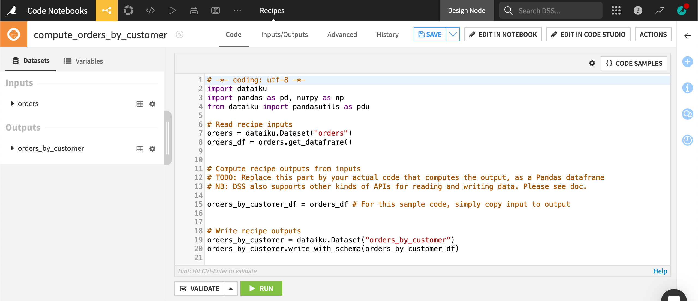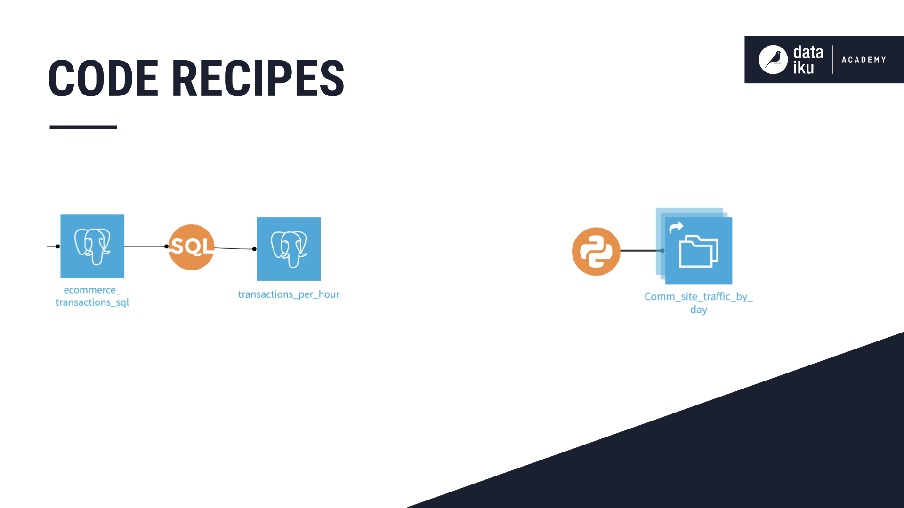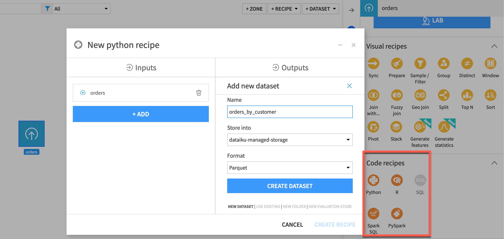

- **Container = full-page editor** ("leave the canvas, go deep"). The only modal is _creation_ (pick inputs → name output → storage); editing is a full page.
  
- **Layout:** center code editor (dark, starter code pre-seeded) · left rail (inputs/outputs, reusable snippet library) · top bar (name + **Validate** + **Run**).
  
- **Lifecycle:** _Validate_ = cheap schema/syntax check without executing (SQL adds "display first rows"); _Run_ = a real job; errors live in a separate Job/Log view, not inline.
  
- **Emphasis:** code recipes are colored circle nodes in the Flow (blue=dataset, yellow=visual recipe, **orange=code recipe**, glyph = language). Code is _flagged but encapsulated_ — click to open.
  
- **Managed vs raw gradient:** SQL _query_ recipe = write just a `SELECT` (plumbing hidden); SQL _script_ recipe = write the whole thing (escape hatch). Worth stealing.
  

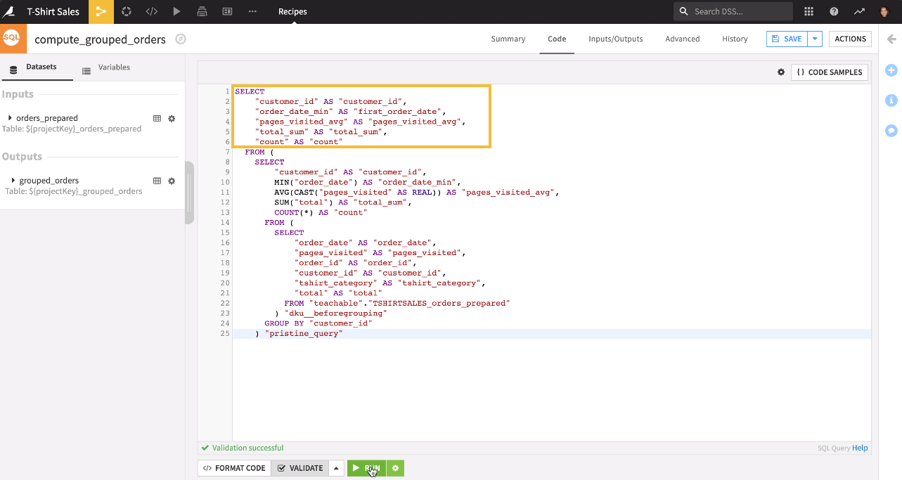
## Databricks — code-first editor **and** no-code designer
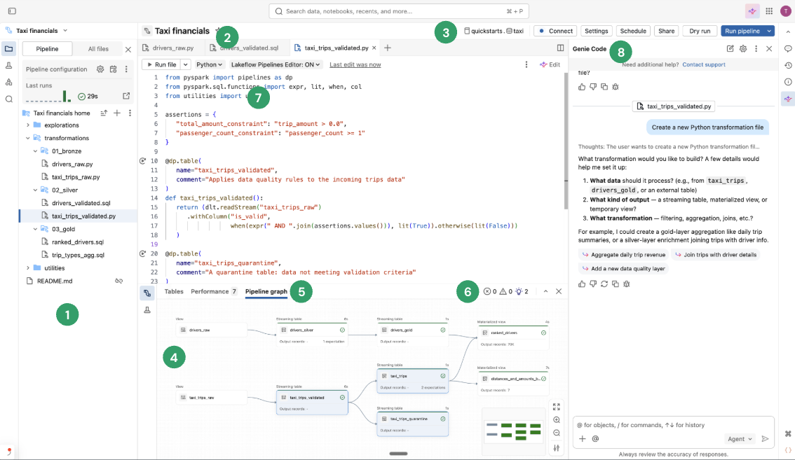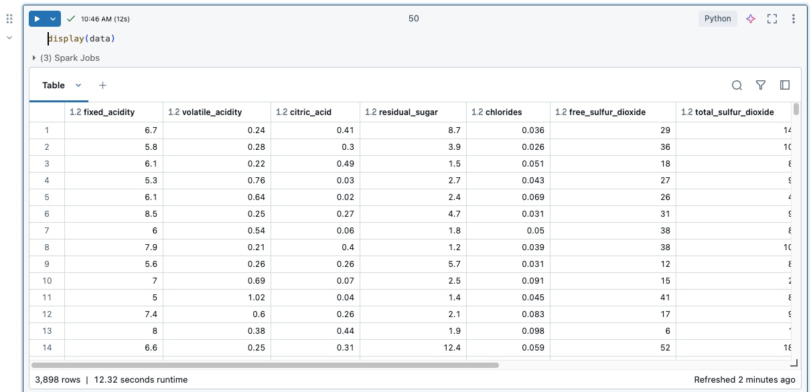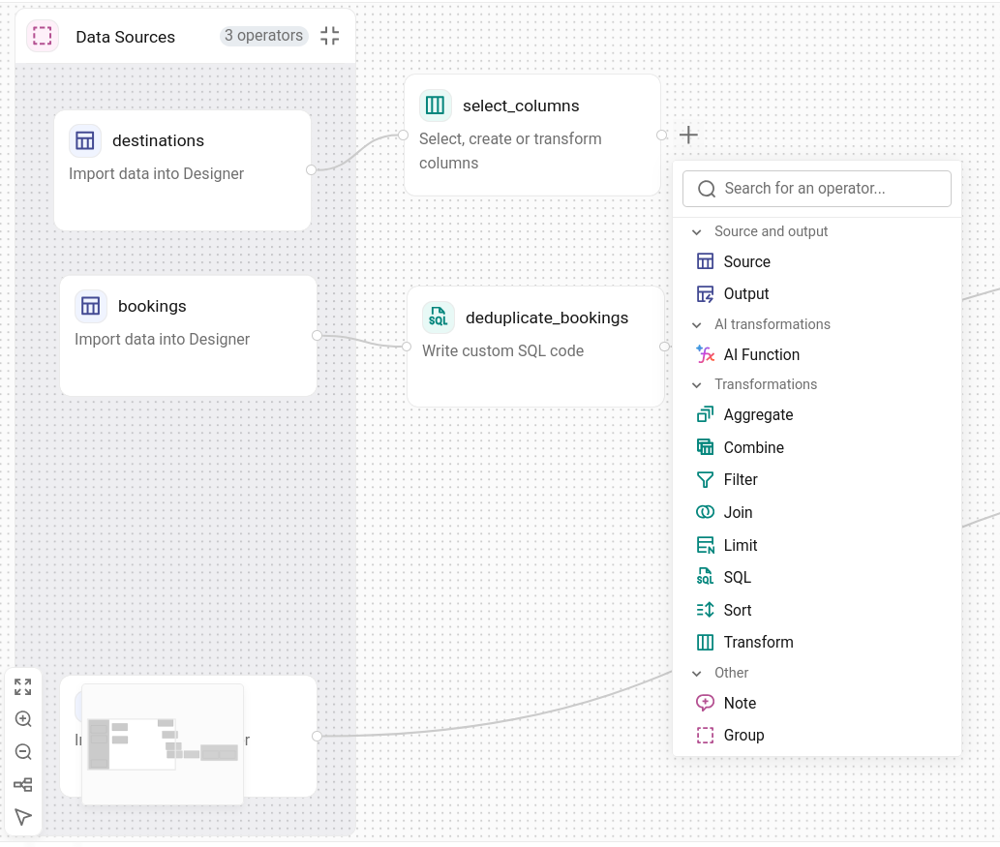

- **Two surfaces, inverted emphasis:** the _Editor_ foregrounds code with the graph docked; the _Designer_ foregrounds the graph with code hidden (custom-SQL node as the escape hatch; live per-node preview).
  
- **Editor layout:** left asset browser · center multi-file tabbed code · **bottom dock** = DAG + Tables + Data Preview + Issues. The graph is a persistent companion, not the primary object.
  
- **Debug is dual-channel:** red inline markers at the offending line **+** an aggregated **Issues panel** that deep-links. Run at four granularities (pipeline / file / table / selection).
  
- **Downstream:** edges auto-derived from dataset references; a table defined in code auto-materializes as a DAG node. Notebook: SQL result auto-binds to `_sqldf` so the next cell consumes it.
  
- **Borrowable:** per-node preview on click · inline errors + issues list · run-at-selection · auto-derived edges.
  
## Alteryx — docked config panel (code always visible)
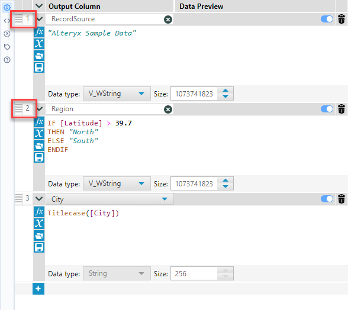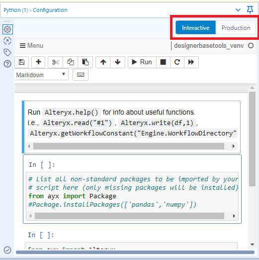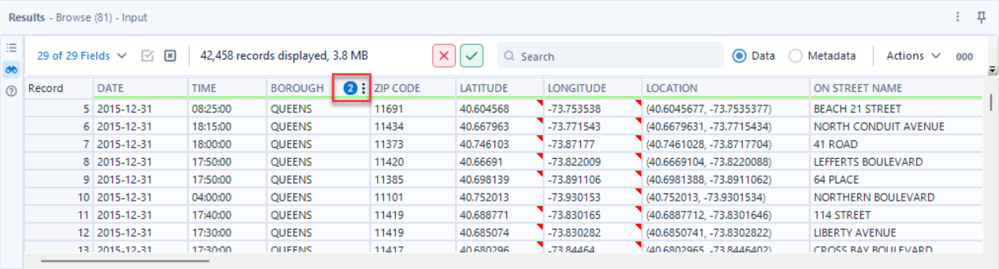

- **Container = docked, always-visible config panel.** Formula tool shows code inline as stacked per-column expression blocks; Python tool embeds a full Jupyter notebook (Interactive vs Production toggle).
  
- **Data crosses via an API:** `Alteryx.read("#1")` → DataFrame; `Alteryx.write(df, 1)` → output anchor 1.
  
- **Output → bottom Results window** (shared, canvas-level; Data/Metadata toggle). Errors flagged on the tool + in Results.
  
- **Downstream = physical anchors/wires** you drag; the numbered `write` calls define which wire carries which table.
  
## KNIME — modal editor per node (canvas stays clean)

- **Container = modal dialog** (double-click the node). IDE-style: left I/O + flow-vars (drag to insert reference) · center editor · bottom console + variables + (for views) live output preview.
  
- **Iterate without closing:** "Run all" / "Run selected lines" against a persistent process. Built-in AI (K-AI) proposes code as an accept/discard **diff**.
  
- **SQL node** = same modal with a metadata browser + **Evaluate** (returns first ~10 rows inline).
  
- **Emphasis:** canvas stays clean; code is invisible until you open the modal — signalled only by the node icon + annotations. (Trade-off vs Alteryx's always-visible panel.)
  
## Coalesce — the "spreadsheet node" (column-level code)
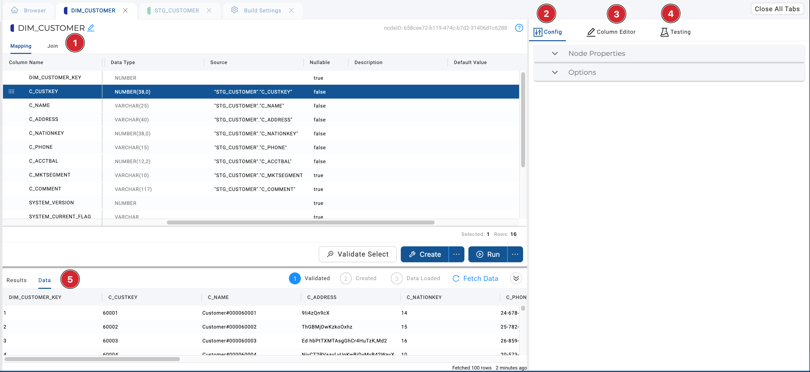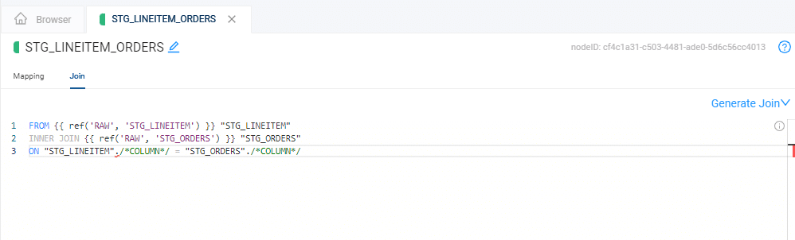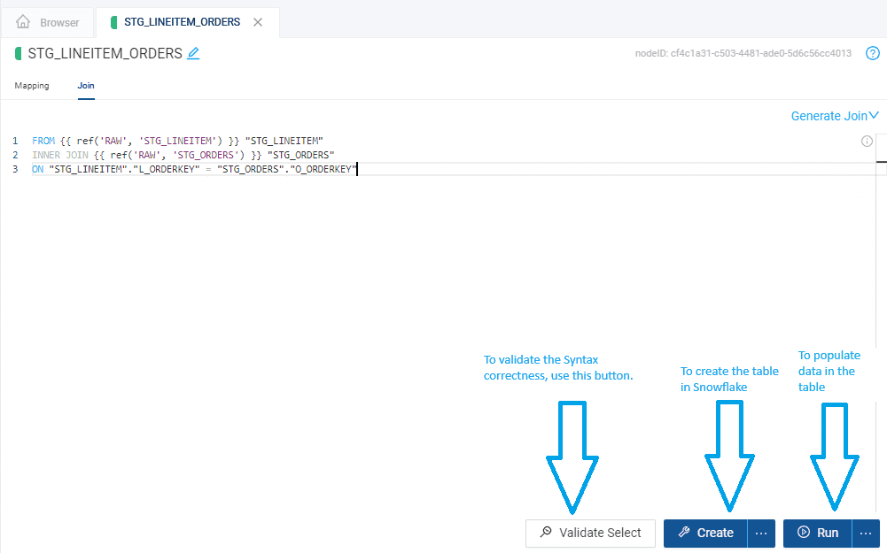

- **Container = full-width node editor:** left **Mapping grid** (rows = columns; you type SnowSQL in a per-column _Transform_ cell) + right **Config**. Code is authored at _column_ granularity, and the node assembles the full statement from a template.
  
- **Generated-code + override:** most SQL is template-generated and inspect-on-demand (Results & Data pane); the **Join tab** is the clearest override — hand-edit the auto-generated JOIN.
  
- **Lifecycle = Validate → Create → Run** (Validate wraps in `EXPLAIN`, no execution).
  
- **Column-aware / lineage-aware:** drag columns from upstream; source mapping per column powers auto lineage + downstream node spawning.
  
## Matillion — canvas node + properties panel, read-only "Preview SQL"
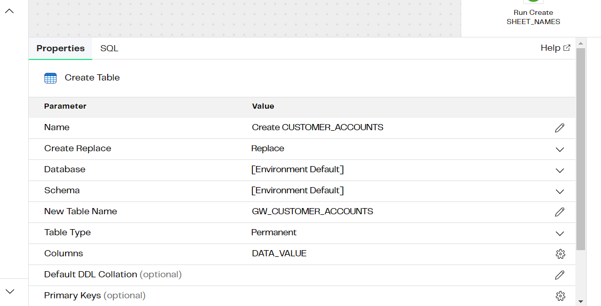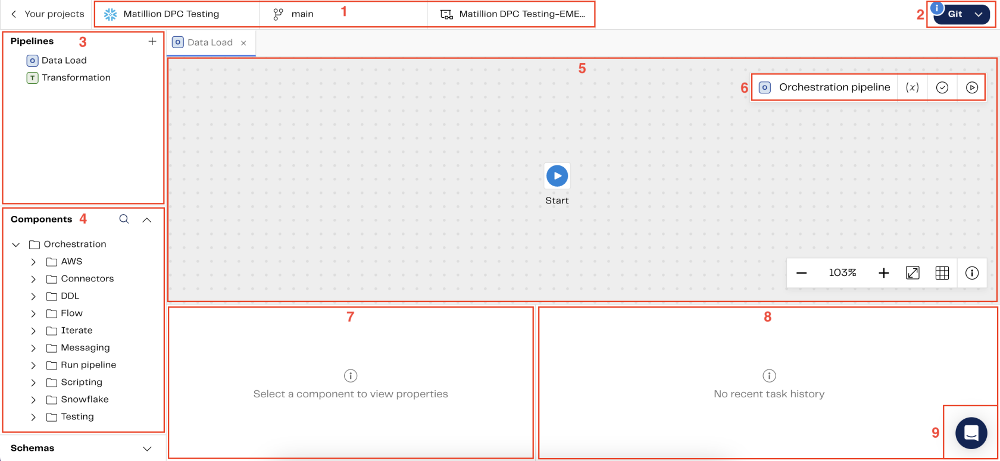

- **Container = right Properties panel** (collapsible Connect/Configure/Destination/Advanced). Code lives inside a property field (the SQL component's Query field is an embedded editor; upstreams referenced as `$T{Component}`).
  
- **Generated-code = read-only "Preview SQL" toggle**, _gated on validate_ — you inspect the real SQL but can't edit it (unless it's the hand-written SQL component). Clear locked-vs-editable split.
  
- **Lifecycle:** configure → validate → **bottom data-sampling pane** → run (component / from-component / whole pipeline).
  
## Power Query — progressive disclosure to a full-code modal
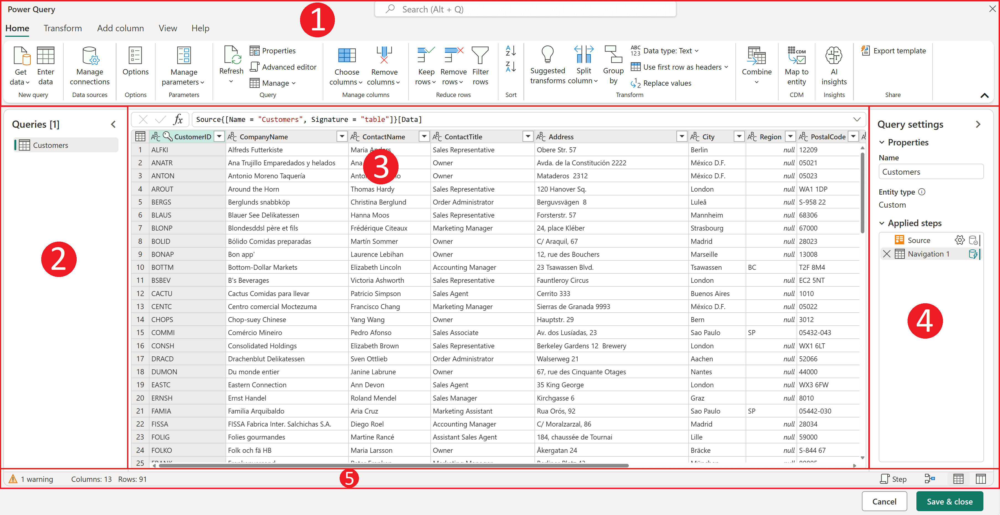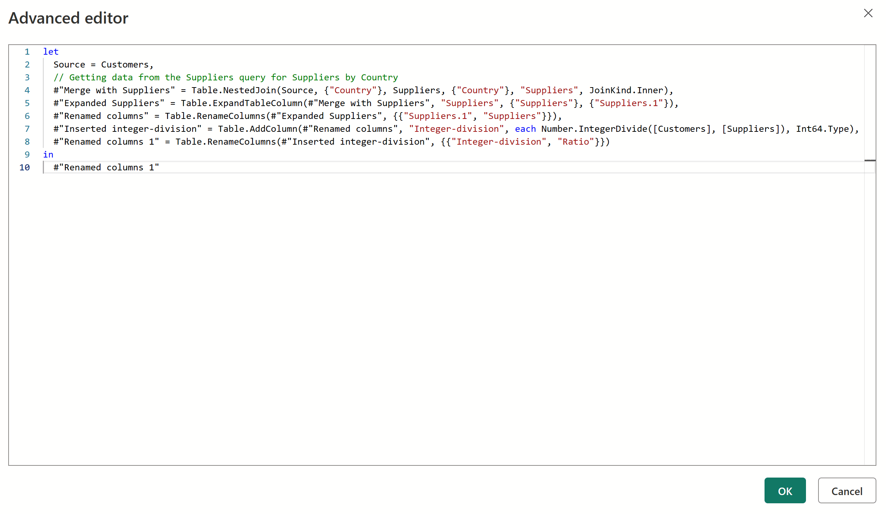

- **Every visual step = one line of M code**, same name, same order. The Applied Steps list _is_ the code, collapsed. Selecting step N previews the table "as of" that line.
  
- **Three-stage disclosure:** ribbon/dialog config → **formula bar** (current step's M) → **Advanced Editor modal** (whole-query M, big surface, syntax-validated, commit on Done).
  
- **Round-trip, not a mode switch:** hand-written code still appears as a step. Escalation is stated plainly — the UI covers "hundreds" of transforms; drop to code only when it can't.
  
## Tableau Prep — visual calc → typed expression, before/after preview
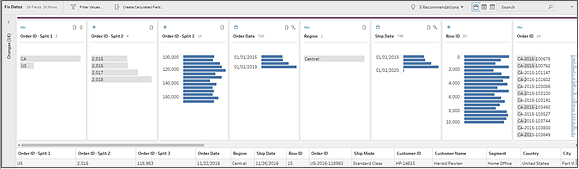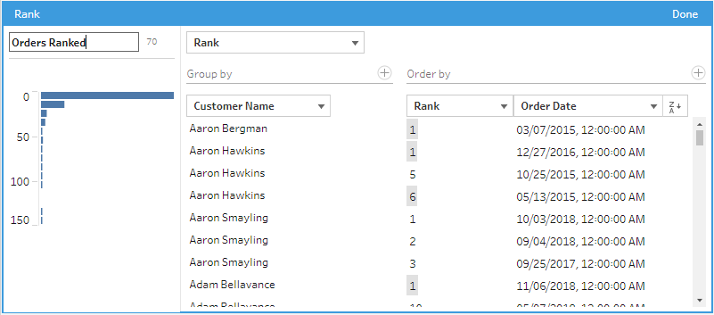

- **Three zones:** Flow DAG (top) · Profile pane (center, histograms — "understand the data") · Changes pane (left, log of every edit in the step).
  
- **Escalation ladder:** menu op → **visual calc builder** (Prep writes the calc) → **typed expression** (LOD/RANK/etc.). Both round-trip to the same Changes entry (right-click → Edit reopens the visual editor).
  
- **Before/after is first-class:** live results preview in the editor; structural steps labelled whether a change runs _before_ or _after_ the reshape.
  

* * *
## What this means for Data Studio
Given our **60/40 modeling-vs-transformation** priority (canvas/modeling stays primary; code is the capable-but-secondary 40%):

- **Right panel = the block editor** — code-first for SQL/Python; UI-first for prep/join/formula; resizable. (Alteryx/Matillion/Coalesce precedent.)
  
- **Bottom panel = shared data preview/output**, always — a block's run result shows here like every block. No code in the bottom (kills the tab-switching problem).
  
- **Every block has a code view**, round-trippable with its UI (Power Query / Tableau Prep pattern) — emphasizes code without a special surface, keeps common ops simple.
  
- **Single-unit blocks** (1 block = 1 step → 1 output); notebook-multi-cell is a heavier future mode only.
  
- **Emphasis = a canvas node token** (language badge + snippet peek), Dataiku-style.
  
- **Full-screen = optional escape** for genuinely large code — not the default (would let code dominate, against 60/40).
  
- **Debug:** inline error markers + a small issues/console area; output auto-becomes a downstream node.
  
## Sources
- Dataiku: [code recipes](https://knowledge.dataiku.com/latest/code/getting-started/concept-code-recipes.html) · [SQL recipes](https://doc.dataiku.com/dss/latest/code_recipes/sql.html)
  
- Databricks: [Lakeflow Pipelines Editor](https://docs.databricks.com/aws/en/ldp/multi-file-editor) · [Lakeflow Designer](https://www.databricks.com/blog/announcing-public-preview-lakeflow-designer) · [notebook outputs](https://docs.databricks.com/aws/en/notebooks/notebook-outputs)
  
- Alteryx: [Formula tool](https://help.alteryx.com/current/en/designer/tools/preparation/formula-tool.html) · [Python tool](https://help.alteryx.com/current/en/designer/tools/developer/python-tool.html) · [Results window](https://help.alteryx.com/current/en/designer/workflows/results-window.html)
  
- KNIME: [Python (K-AI)](https://docs.knime.com/ap/latest/python_installation_guide/data-tasks/k-ai-assistant) · [custom SQL](https://docs.knime.com/ap/latest/databases/custom-sql-query/)
  
- Coalesce: [Node Editor](https://docs.coalesce.io/docs/build-your-pipeline/the-build-interface/node-editor) · [phData tutorial](https://www.phdata.io/blog/coalesce-basics-getting-started-creating-your-first-data-pipeline/)
  
- Matillion: [SQL component](https://docs.matillion.com/data-productivity-cloud/designer/docs/sql/) · [transformation pipeline](https://www.matillion.com/blog/how-to-build-a-transformation-pipeline-in-the-data-productivity-cloud)
  
- Power Query: [editor UI](https://learn.microsoft.com/en-us/power-query/power-query-ui)
  
- Tableau Prep: [clean & shape](https://help.tableau.com/current/prep/en-us/prep_clean.htm) · [calculations](https://help.tableau.com/current/prep/en-us/prep_calculations.htm)
