# UX walkthrough — the three key workflows, run and recorded

_2026-08-12. Three workflows driven end to end in a real browser against `?v=pocv2`, screenshot
at every step, with feedback per step. Screenshots in `2026-08-12-ux-walkthrough/`._

**Setup.** Vite on `localhost:5174`, viewport 1600×1000. Before running, the six tables the POC V2
browser tree offers were given realistic row counts (`dim_accounts` 48K, `csm_account_mapping`
1.2K, `support_cases` 4.2M, `call_metrics` 12.4M, `customer_found_defects` 1.8M,
`pendo_nps_enriched` 2.6M). Without that every table was 45–1,240 rows, `classifyRole`'s 500K
threshold called all of them dimensions, and the windowed path could not appear at all.

**Four bugs were found and fixed while running this**, marked ⚠️ **FIXED** inline. Three were
invisible to typecheck and build — they only show up when the thing runs.

**A further six items were fixed in the pass straight after**, and are marked ✅ **FIXED AFTER**
where they appear. The two lists at the bottom are current.

---

## Workflow A — single-source model

Two tables from the same warehouse. The interesting question: does caching stay out of the way?

### A1 · Data objects landing
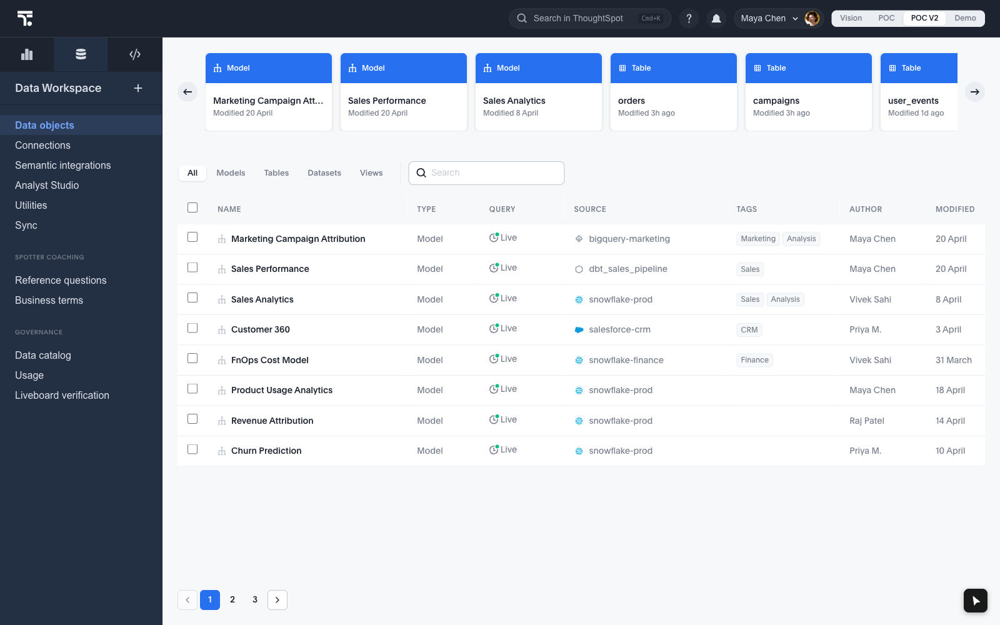

The `Query` column works — every model shows the clock glyph with a green dot and "Live".

**Feedback.** ✅ **FIXED AFTER.** Column order was Name → Type → **Query** → Source, so "Query:
Live" landed before you knew what it was querying. Now Source → Query, which reads as one thought.

### A2 · `+ → Model → New canvas`
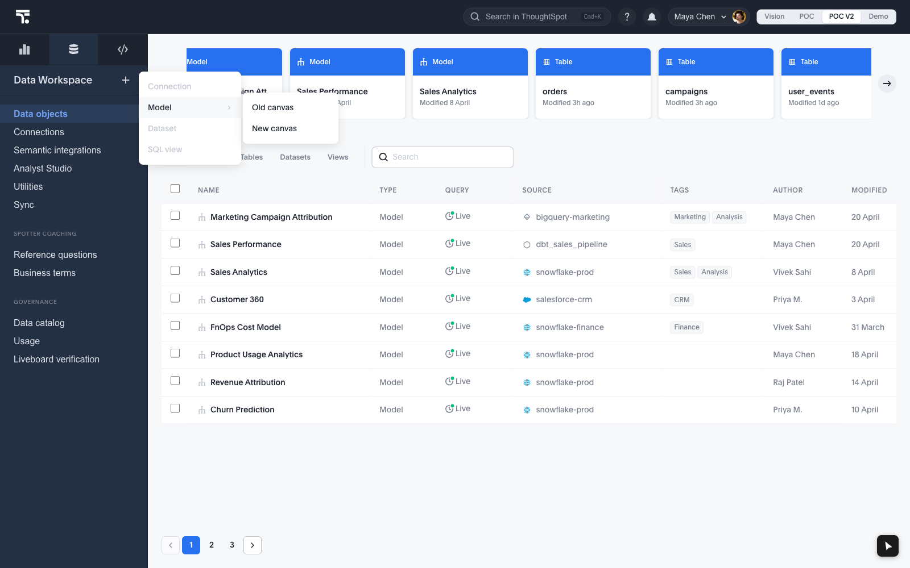

Connection, Dataset and SQL view are visibly disabled; only Model is live, opening Old canvas /
New canvas.

**Feedback.** Three of four items in the menu do nothing. Showing them greyed says "this exists
but not for you", which is a reasonable choice in a workspace shell — worth a conscious decision
rather than an inherited one.

### A3 · Empty canvas
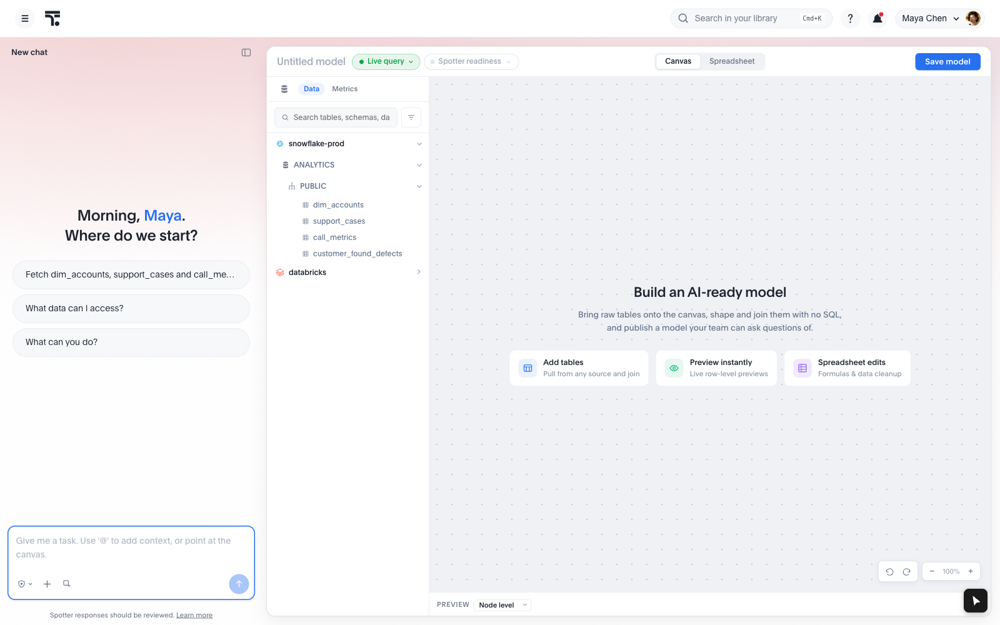

`Data` / `Metrics` tabs share the left dock. Two connections: `snowflake-prod` expanded,
`databricks` collapsed. Empty state gives three affordances.

**Feedback.** ⚠️ ✅ **FIXED AFTER.** The **Spotter readiness** pill was in the topbar while AI
readiness is out of MVP (`POCV2_STATUS.md`: "AI readiness: phase 2"), failing POC's own test —
*nothing on screen claims to work when it doesn't*. Now hidden in POC V2.

**Feedback.** ✅ **FIXED AFTER.** The empty state said "publish a model your team can ask questions
of" after POC V2 renamed publish to **Save**.

### A4 · Table detail flyout
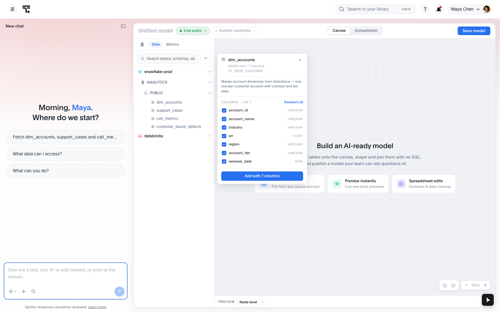

Click a row → metadata, description, seven checkboxed columns, `Add with 7 columns`.

**Feedback.** ✅ **FIXED AFTER.** `48000 rows` had no thousands separator — the first number in
the product a user reads.

### A6 · Two tables, one warehouse

Both land. Property panel opens on the second. Agent suggestions update contextually to "Are these
tables clean? / Join these tables into a model".

**⚠️ Feedback — two row counts for one table.** ✅ **FIXED AFTER.** The flyout said
`dim_accounts` has 48,000 rows. The property panel said `support_cases` had **5 rows, 2 KB**. Two different sources: the flyout
reads `tableMetadata`, the panel reads the length of the mock preview array. The same table will
report 4.2M in one place and 5 in another, and the caching estimate reads the first while the user
is looking at the second.

### A7 · Node menu
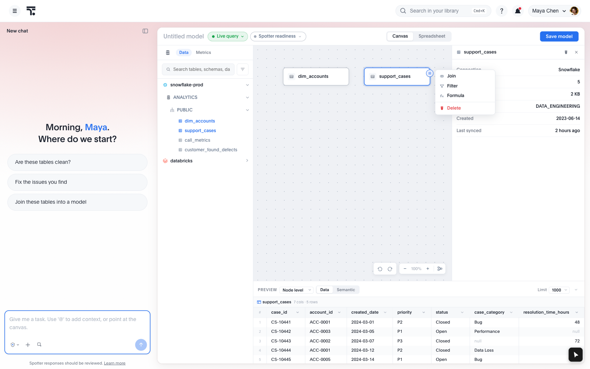

Join · Filter · Formula · Delete. No Clean, no Code — correct for POC V2.

**⚠️ Feedback — Filter is on the card.** The locked decision is *"Filter/formula: model-level
only. Not on a card, not on a join edge."* The menu offers a card-level filter. This also answers
the open "filters have no home" question: they have one, and it's the one the decision rules out.

### A8 · Create Join panel
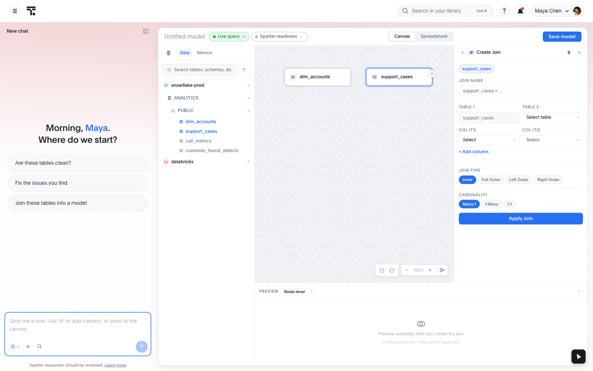

Table 1 fixed, Table 2 / Col (T1) / Col (T2) empty, join type, cardinality, Apply Join.

**Feedback.** Nothing is pre-filled. `account_id` is present in both tables and is the obvious
key — the (dormant) drag-to-connect path does infer it (`cols1.find(c => cols2.includes(c))`), so
the inference exists and this panel doesn't use it.

**Feedback.** Join type defaults to **Inner**. Our own research says inner joins *hide*
cache-boundary row loss while outer joins show it as nulls. Harmless here; wrong default once a
window is active.

### A9 · Join applied — no caching prompt
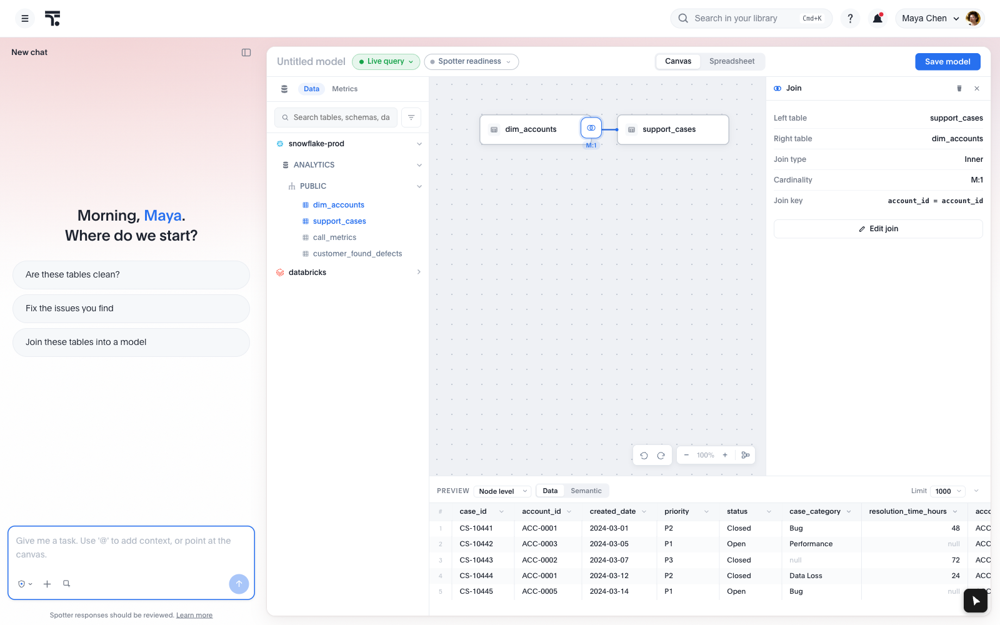

Edge drawn with the `M:1` badge and join-type glyph, panel switches to a read-only summary with
Edit join, preview shows merged rows. **Caching is never mentioned** — correct, one warehouse
pushes down.

**⚠️ Feedback — the join key appears twice.** `account_id` is in the merged output at position 2
*and* again at the far right, and React logs 18 "two children with the same key: account_id"
errors. This is item #10's FK-dedup rule, decided in `research/fk-column-deduplication.md` and not
implemented.

### A10 · Metrics list
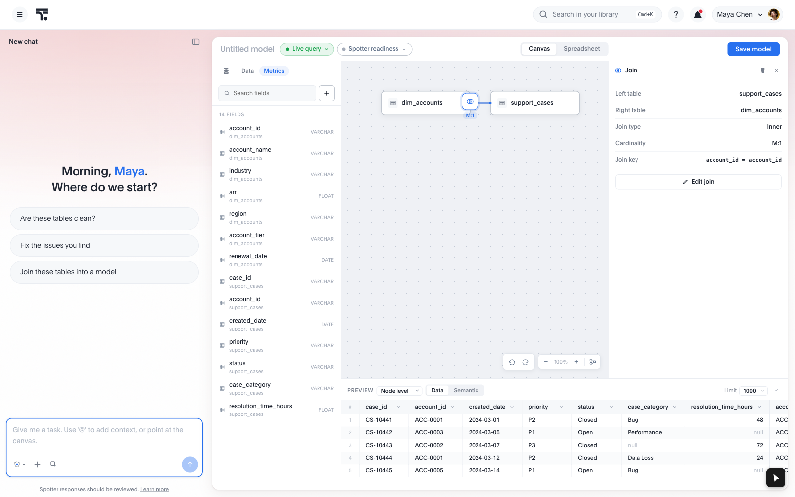

14 fields, flat, each with its source table beneath.

**Feedback.** `account_id` appears twice with nothing to tell them apart. Same root cause as A9,
but this is where a user has to pick one.

### A11 · Formula panel
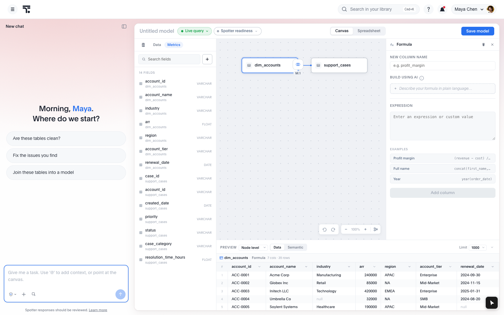

⚠️ **FIXED during this run.** The `+` was `disabled={!selectedId}`. It now works with nothing
selected, filing the formula on the model's most-connected table. A model-level metric spans
tables; demanding you first pick one contradicted the pane.

**Feedback — no field picker.** The expression box is free text with three static examples. There
is no way to insert a column, and a pane listing all 14 fields is directly to its left. For a
cross-table metric the user types column names from memory.

### A12 · Formula added
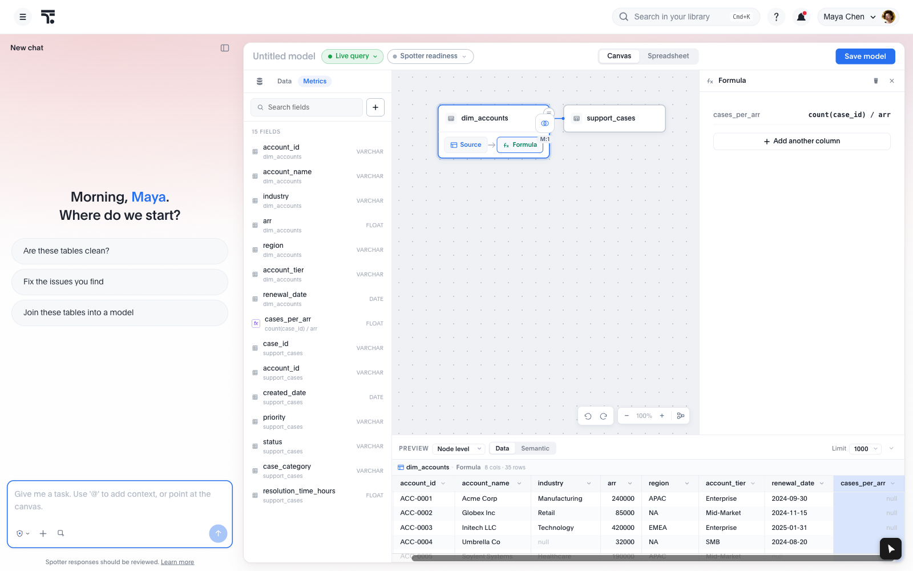

15 fields now, `cases_per_arr` with the `fx` badge and its expression as the subtitle. The card
grows a `Source → Formula` chip. The preview gains the column.

**🔴 Feedback — formulas were never evaluated.** Every value was `null`. Verified it wasn't the
expression: `arr / 1000` on one table where `arr` = 240000 was also `null`.

✅ **FIXED AFTER.** There was a real evaluator all along — `commitFormula` — with exactly one
caller: the Spreadsheet's formula bar. The property panel stored the expression, added the column,
scrolled to it and computed nothing. The evaluator is now extracted as `evaluateFormula` and both
paths use it. Verified in the browser: `arr / 1000` returns 240, 85, 420, 32.

⚠️ **The lesson survives the fix.** This was the third instance of one pattern — the working code
existed and the path in use didn't reach it. Same as the badge on the wrong card component and the
gate on the wrong join path.

### A13 · Saved → detail page
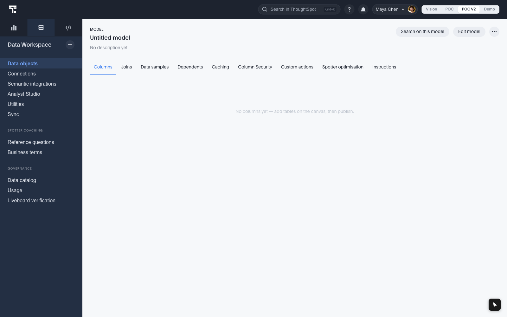

Save lands on the view state. The **Caching** tab is present.

**Feedback.** Three things: the model is still called **"Untitled model"** and nothing asked;
the Columns tab says **"No columns yet — add tables on the canvas, then publish"** despite 15
fields on the canvas (`MODEL_DETAILS` has no entry for a new model); and that copy says "publish"
again.

### A14 · Caching tab, single-source
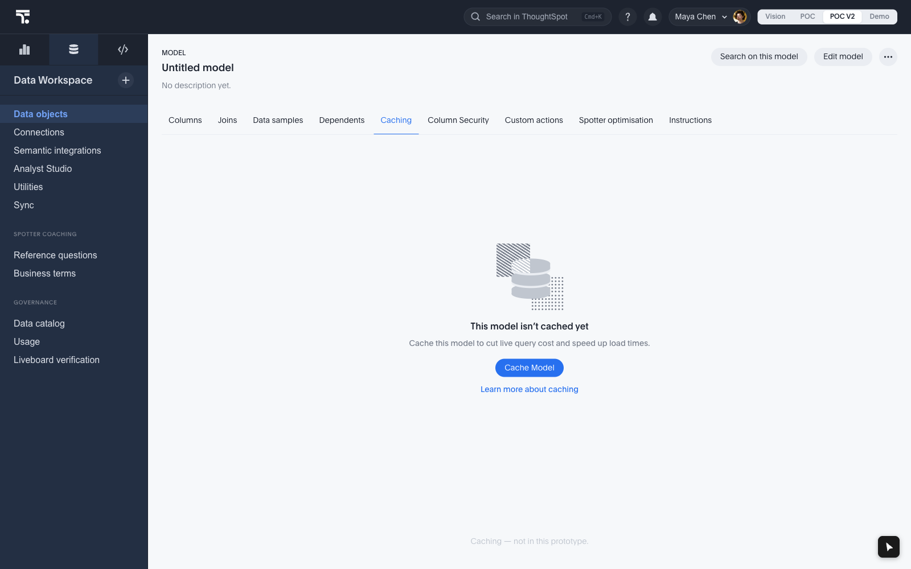

Near Store's empty state: *"This model isn't cached yet — cache this model to cut live query cost
and speed up load times"*, with Cache Model.

**Correct behaviour.** Single-source, so caching is offered as an optional performance win, not
required. `canFallBackToLive` is true and the copy reflects it.

⚠️ **FIXED during this run.** The page printed **"Caching — not in this prototype."** underneath
the working tab, from a `tab !== 'Columns' && tab !== 'Joins'` placeholder.

**Verdict on A: the single-source path works and never mentions caching.** That fell out of the
source-comparison rule rather than needing a special case.

---

## Workflow B — multi-source model

### B3 · Two warehouses on the canvas, no prompt
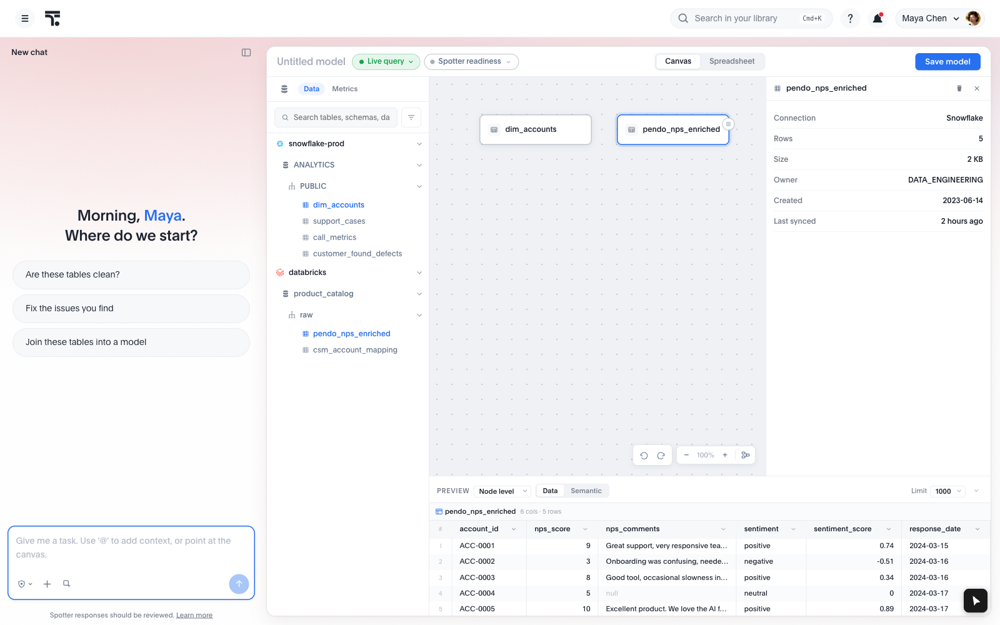

`dim_accounts` (snowflake-prod) and `pendo_nps_enriched` (databricks) both land with no caching
prompt. Step 1 of the flow, working — dropping is not a caching touchpoint.

### B4 · The caching notice
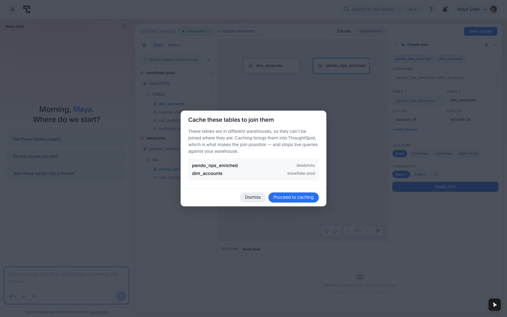

Applying the join raises it: *"Cache these tables to join them"*, both tables listed with their
warehouses, Dismiss / Proceed to caching.

**Reads well.** Info not error, and naming the two warehouses is what makes the reason legible
rather than asserted.

**Feedback.** Dismiss still discards the join — the dashed pending-edge fix is specced, not built.

### B5 · The caching modal
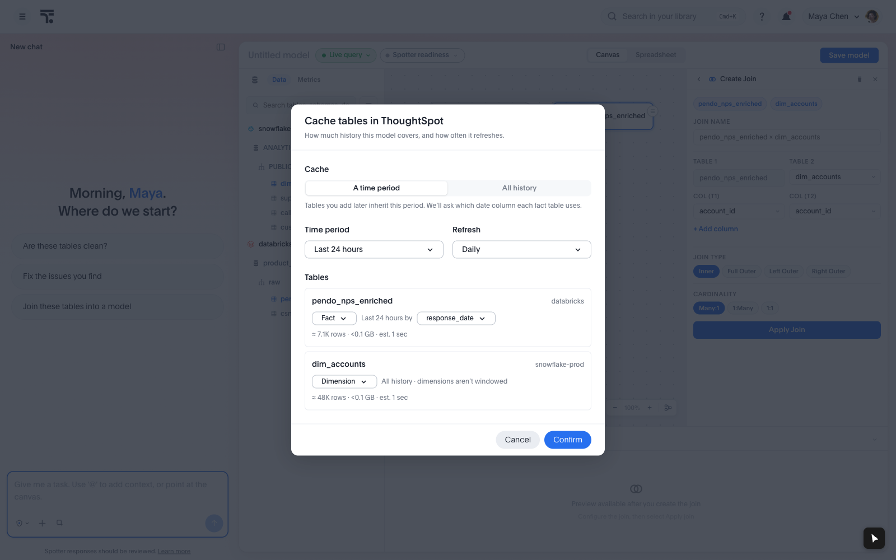

The classification works: `pendo_nps_enriched` → **Fact**, "Last 24 hours by `response_date`";
`dim_accounts` → **Dimension**, "All history · dimensions aren't windowed". Policy choice states
its own future. Time period and Refresh present.

**Feedback — the estimate is uninformative at this scale.** Both rows read `<0.1 GB · est. 1 sec`.
A readout that always says "instant" trains the user to ignore it, and it's the control that's
meant to make the window choice meaningful. It only earns its place above ~50M rows.

### B6 · Filling
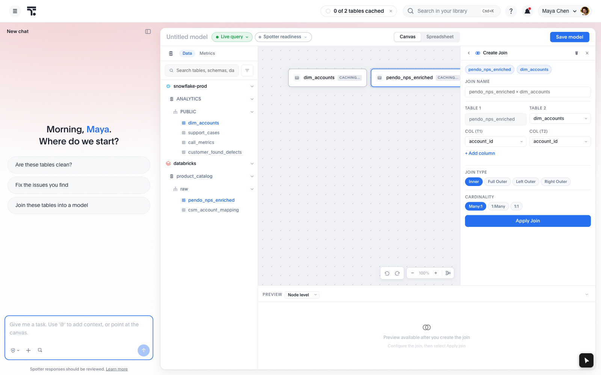

Header chip counts `0 of 2 tables cached`; both cards show `CACHING…`.

⚠️ **FIXED during this run — and this one was fully invisible to typecheck.** Initially the chip
counted while **neither card showed anything**. The `residency` prop was on `CanvasNodeCard`, but
POC V2 runs `dataset2` mode → `isBlockMode` is true → it renders **`BlockNode`**. The badge was on
the component that never mounts. Exactly the same mistake class as gating `wireEnd`, which is also
dead in this mode.

**Feedback.** The badge truncates to `CACHING...` on a card with a long name.

**Feedback.** The property panel still shows the Create Join form with an active Apply Join while
the join it configured is being held. Nothing says "this join is pending".

### B8 · Cached, and the join resumed itself
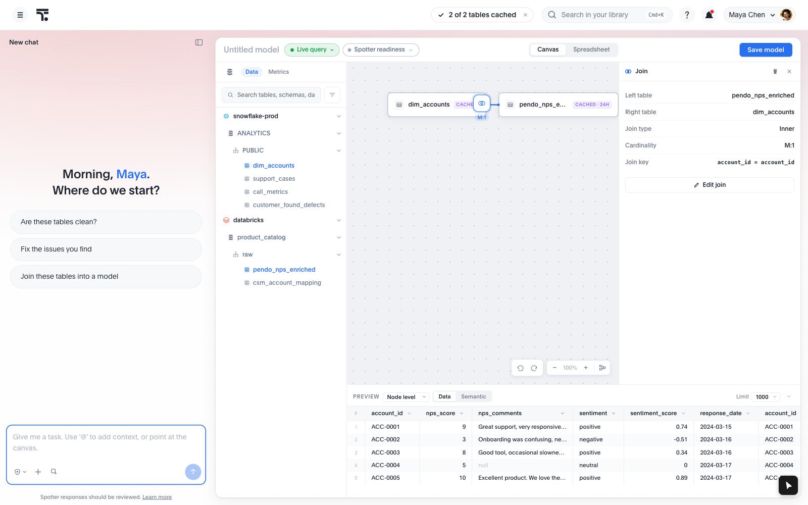

Chip ticks to `2 of 2 tables cached`, badges read `CACHED` and `CACHED · 24H`, and **the join
commits on its own** — edge drawn, panel showing the finished join. This is the headline behaviour
of the whole feature and it works.

⚠️ **FIXED during this run — it did not work at first.** When the fill completed the notice
*reappeared*, asking to cache `dim_accounts` while `dim_accounts`' own badge read `CACHED`. Cause:
the replayed join re-entered `cacheGate`, and the gate reads residency from its render closure —
scheduled from the same effect that marks the tables cached, it saw the pre-cache state. A
one-tick `setTimeout` was tried and is a race (React's commit and a timer have no defined order).
The real fix is that a **resumed join must not re-enter the gate at all**: it already passed it,
and the cache it waited for just finished.

That fix then surfaced a fifth trap the type checker caught: `onClick={applyJoin}` passes the
MouseEvent as the new `resumed` argument, which is truthy — so the two Apply Join buttons would
have silently skipped the gate. Both call sites now wrap it.

---

## Workflow C — edit an existing model, add a table

### C1 · Third table joined → only the new table is listed
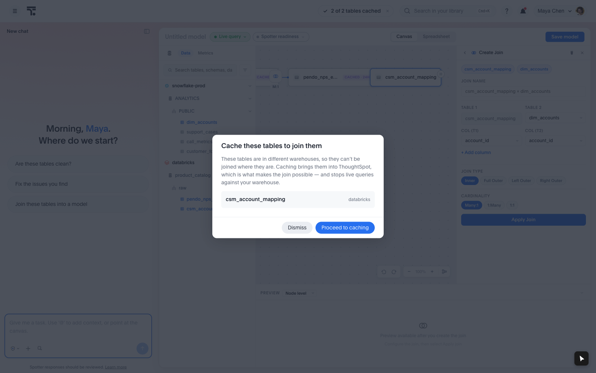

`csm_account_mapping` added and joined. The notice names **only `csm_account_mapping`** — the two
already-cached tables are excluded.

**This is the behaviour you asked about, confirmed:** joining another table asks about *that*
table, not the ones already done. Note it's also a real test of the anchoring rule —
`csm_account_mapping` is on `databricks`, the same warehouse as the already-cached
`pendo_nps_enriched`, and it still needs caching, because a cached table's data lives in
ThoughtSpot and the new one's does not.

### C2 · Modal seeded from the model's existing settings
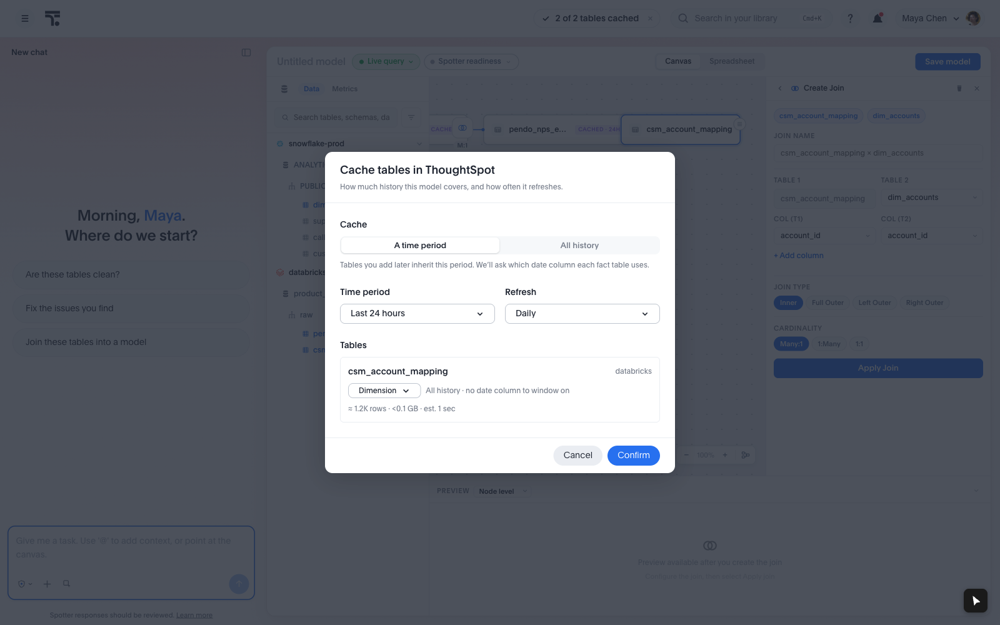

"A time period", "Last 24 hours", "Daily" — all inherited, not reset to defaults. One table listed,
classified Dimension with *"All history · no date column to window on"*, which is right:
`csm_account_mapping` has no date column.

**Verdict on C: works, including the two subtle parts** — inheritance of the model's period, and
excluding tables that already hold a cache.

---

## Bugs found by running it

| # | Bug | Caught by |
|---|---|---|
| 1 | Metrics `+` disabled without a canvas selection | Walking A11 |
| 2 | `Caching — not in this prototype.` printed under the working Caching tab | Walking A14 |
| 3 | **Cache badges never rendered** — prop on `CanvasNodeCard`, POC V2 renders `BlockNode` | Watching B6 |
| 4 | **The resumed join re-prompted for caching**, for tables already cached | Watching B8 |
| 5 | `onClick={applyJoin}` would pass the MouseEvent as `resumed` and skip the gate | Typecheck, after fixing 4 |

⚠️ **Three of these five were invisible to `tsc` and `npm run build`.** Bugs 3 and 4 are the two
that matter, and both are of the same kind: code wired to the component or the state that isn't
the one in play. That is the argument for running the thing rather than verifying it compiles.

## Fixed in the pass after the walkthrough

Formulas now compute (shared `evaluateFormula`) · one row count per table, and the property panel
shows the real connection · realistic row counts for four more tables · Spotter readiness pill
hidden in POC V2 · "publish" wording corrected in both places · `48,000 rows` formatted · Query
column moved after Source.

## Still open

**Highest value first.**

1. **The join key duplicates** — `account_id` twice in the merged output and in the Metrics list,
   plus 18 React duplicate-key errors. Item #10's rule is decided and unimplemented. This is now
   the top item, and it's entangled with cardinality: dedup direction depends on which side is the
   "one" side, and cardinality is currently a hardcoded default.
2. **Filter is on the card**, contradicting the model-level-only decision. Needs a decision, not a
   fix — it's the same question as "where do filters live".
3. **A saved model is called "Untitled model"** because nothing asks, and its detail page says
   "No columns yet" despite the fields on the canvas. Left deliberately: prompting for a name on
   save is a flow decision, not a bug.
4. **Dismiss discards the join** (phase 3, specced — the dashed pending edge).
5. **Nothing marks the pending join** in the property panel while its cache fills; Apply Join sits
   there live.
6. **Join type defaults to Inner**, which hides cache-boundary row loss — and Inner is also the
   only case where dedup is unconditionally safe, so the two decisions are linked.
7. **Estimate always reads "instant"** at these row counts.
8. **Badge truncates** to `CACHING...` on longer table names.

Items 4 and 5 are canvas-rendering work on Komal's surface, so they belong with the join spec
rather than here.
